## Tarea-1_TDSE
## Trabajo de TDSE sobre regresión lineal

## Cuaderno #1 - Regresión lineal con una característica (Vectorizado y No Vectorizado)
- Model and loss:
El nuevo dataset dado nos da que la función de costo (J(w,b)) es de 117.69675 L^2. A este valor de la función de costo, como está definido como "error promedio al cuadrado", se toma la raíz cuadrada de lo obtenido, que sería aproximadamente 10.85. Esto representa que en promedio tus predicciones están a ~10.85 unidades de los valores reales, lo cual está mal debido a que los valores van de 0.15 a 35.0.

- Cost surface:
El mínimo de la superficie de costo representa los valores óptimos de los parámetros que mejor ajustan nuestros datos de luminosidad estelar. 

El mínimo corresponde a los valores de w y b que minimizan el error cuadrático medio entre nuestras predicciones (L_hat = w*M + b) y las observaciones reales de luminosidad (L).

w_óptimo: La tasa a la cual la luminosidad estelar aumenta por unidad de masa estelar (la pendiente de la relación masa-luminosidad)
b_óptimo: El intercepto teórico de luminosidad (aunque físicamente no realista en M=0)
J_mínimo: El error residual que no puede ser eliminado, representando ruido en las mediciones o la limitación inherente de un modelo lineal para esta relación

El descenso por gradiente se mueve iterativamente desde cualquier punto inicial en esta superficie hacia el mínimo, siguiendo la dirección de mayor descenso. La forma convexa (tipo cuenco) de la superficie de costo garantiza que el descenso por gradiente convergirá al mínimo global.

La superficie exhibe una estructura claramente convexa con un único mínimo global, lo que confirma que nuestro problema de regresión lineal está bien planteado y que el descenso por gradiente encontrará confiablemente la solución óptima sin importar la inicialización.

## No Vectorizado:
Continuando con lo visto en clase, en primer lugar se toma el dataset dado y se hacen los respectivos cálculos de la gradiente descendiente sin vectorizarlo. Se utilizaron de valores de alpha a 0.01, 0.05 y 0.1

0.01 con 1000 iteraciones:
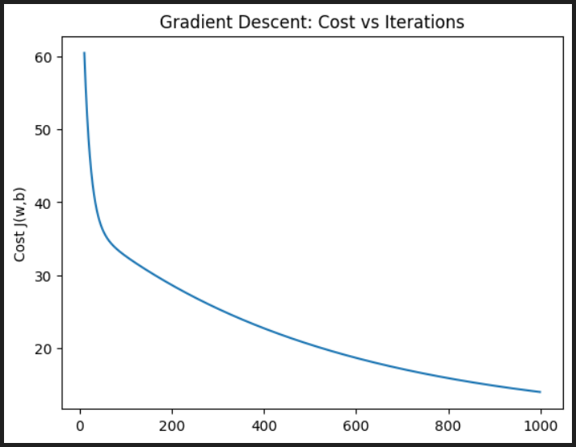
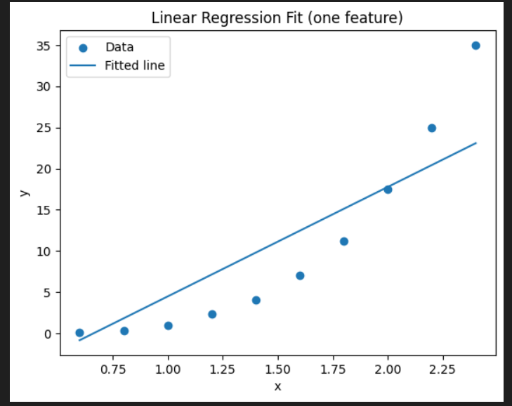

0.05 con 1000 iteraciones:
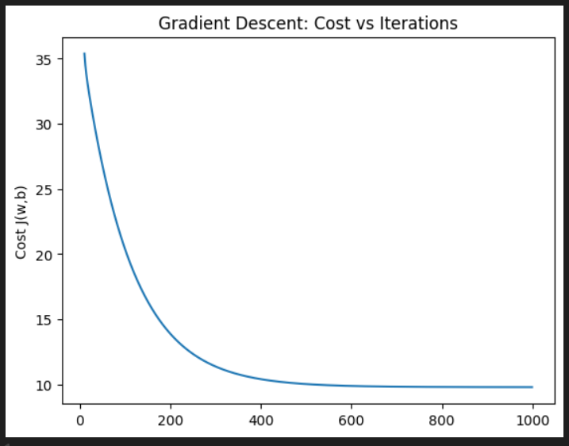
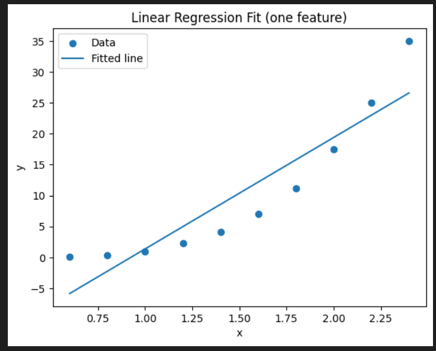

0.1 con 1000 iteraciones:
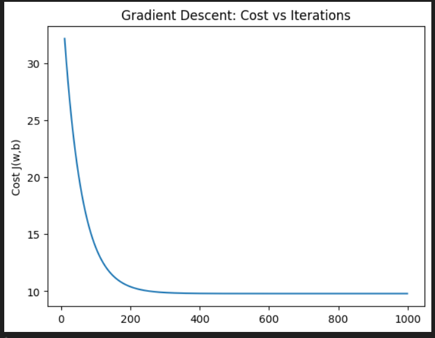
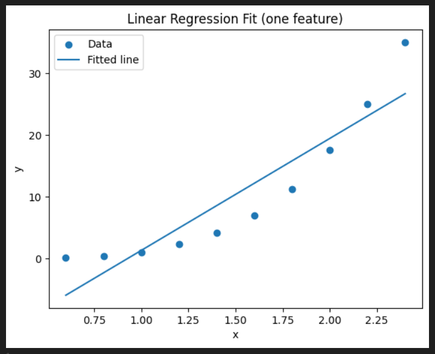

## Vectorizado:

0.01 con 2000 iteraciones:
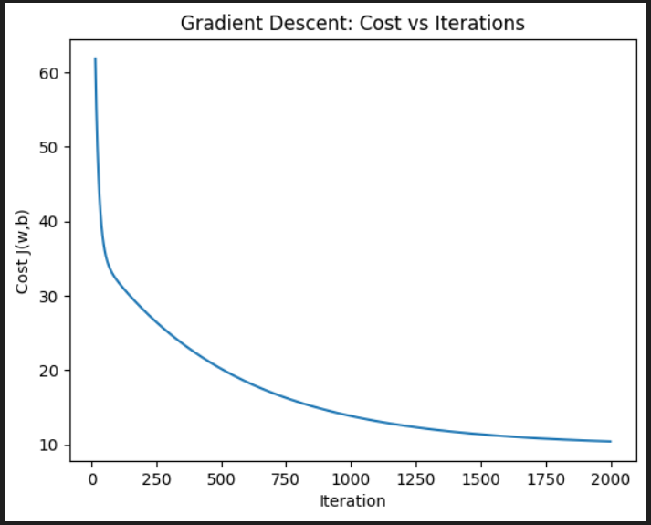
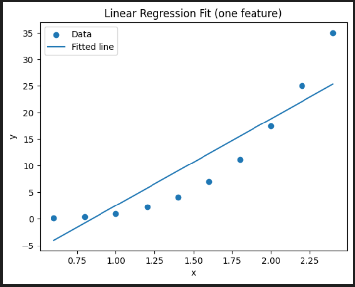

0.05 con 2000 iteraciones:
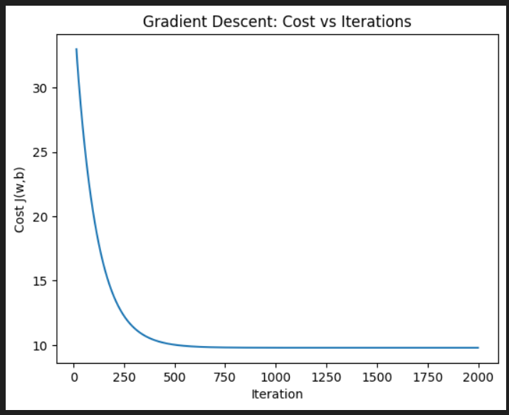
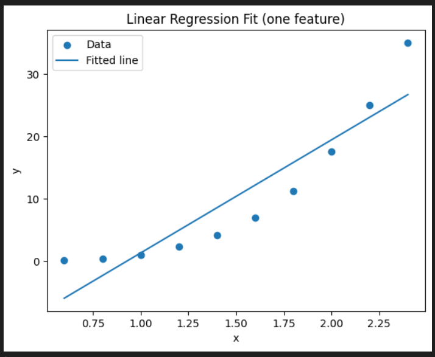

0.1 con 2000 iteraciones:
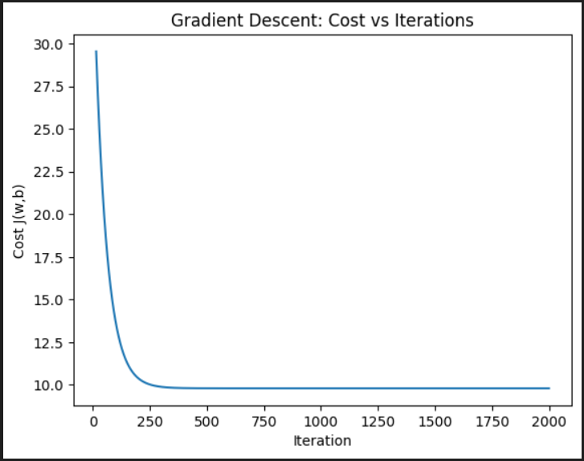
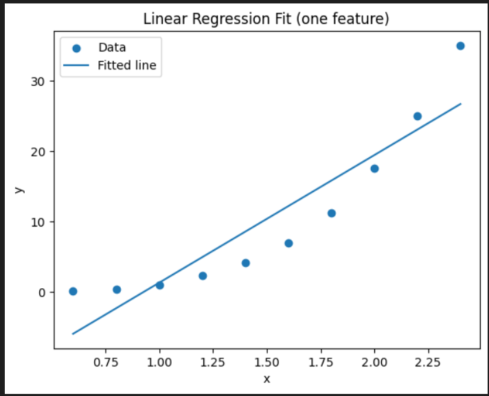

## Convergencia
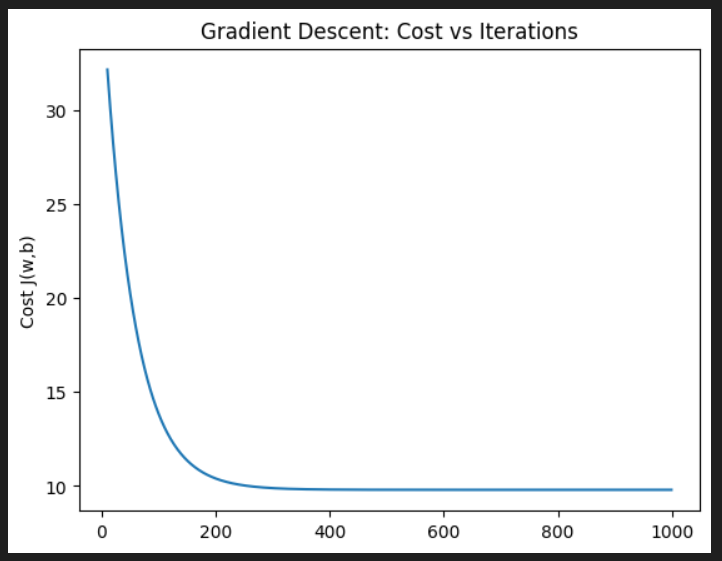

Haremos el análisis con alpha = 0.1 porque es la que mantiene mayor estabilidad y menor porcentaje de error.

Según esta gráfica que nos da el código:
plt.figure()
plt.plot(it_hist[10:], cost_hist[10:])  # skip the first pointplt.xlabel("Iteration")
plt.ylabel("Cost J(w,b)")
plt.title("Gradient Descent: Cost vs Iterations")
plt.show()

Podemos analizar que:
La gráfica muestra una convergencia rápida y efectiva del algoritmo de descenso por gradiente:
- Fase inicial (iteraciones 0-200): Se observa una disminución pronunciada del costo desde aproximadamente J ≈ 32 hasta J ≈ 10. Esta caída abrupta indica que el algoritmo está alejándose rápidamente de la inicialización pobre (w=0, b=0) hacia una región del espacio de parámetros con mejor ajuste.
- Fase de convergencia (iteraciones 200-400): La curva se aplana gradualmente, mostrando que el algoritmo se acerca al mínimo. La tasa de reducción del costo disminuye a medida que los gradientes se vuelven más pequeños cerca del óptimo.
- Fase de estabilización (iteraciones 400+): El costo se estabiliza alrededor de J ≈ 10, indicando que el algoritmo ha alcanzado o está muy cerca del mínimo global. Las variaciones son mínimas después de este punto.

De igual manera, podemos observar que la gráfica presenta una estabilidad, en donde desciende sin oscilaciones y presenta un error no tan grande, no como se pudo evidenciar con las gráficas cuando se utilizó por ejemplo 0.01 como alpha.

## Preguntas conceptuales
1. Representación astronómica de w: 
2. ¿Por qué es limitado un modelo lineal?
Es limitado debido a que podemos tener formas en los datos que no correspondan a una forma lineal, tal y como en este caso que presente una forma más curva, lo cual hace que los datos no queden sobre la línea al hacer la regresión linear, haciendo que haya un error significativo al no elegir el mejor modelo para los datos.

## Cuaderno 2: Regresión con varias características

Para este segundo notebook, se tiene un nuevo dataset, el cual representado gráficamente se ve de la siguiente manera:
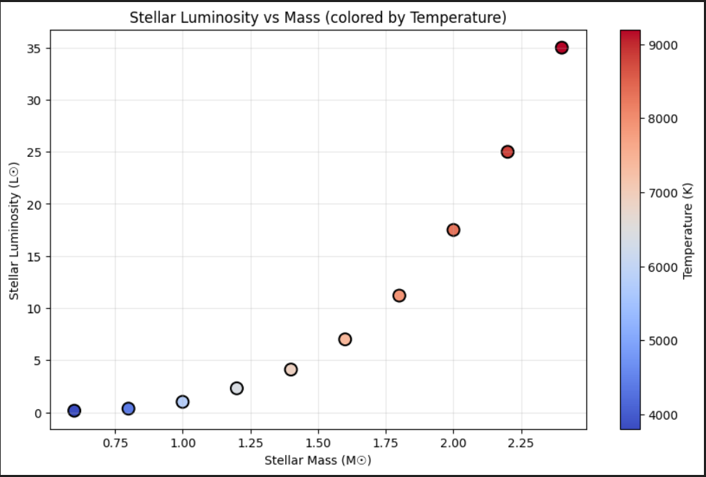

Se puede ver que la luminosidad aumenta rápidamente con la masa (relación no lineal), al igual que la temperatura también aumenta con la masa (mostrado por gradiente de color). Por ende, la relación parece ser más que lineal, lo que sugiere que podrían necesitarse términos polinómicos.

Se encontró tanto la pérdida como los gradientes los cuales dieron los siguientes resultados:
Test with w=0, b=0:
Cost: 117.6967
Gradient dJ/dw: [-10.4151  -9.5976 -10.9942 -10.7188]
Gradient dJ/db: -10.3600

Y la gráfica que dió fue:
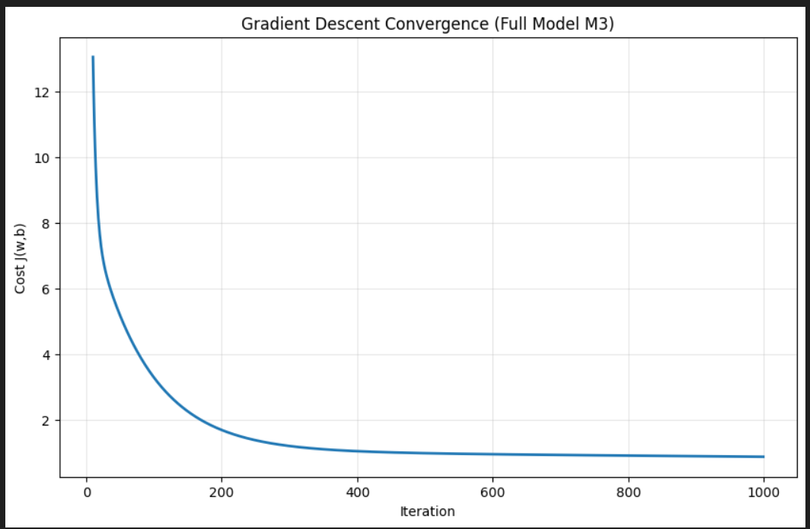

Hallazgos Clave:
1. Impacto de la Ingeniería de Características:
El modelo lineal (M1) presenta un subajuste significativo en los datos de luminosidad estelar. Al agregar el término M² (M2), se captura mejor la relación no lineal entre masa y luminosidad. La inclusión de la interacción M*T (M3) proporciona el mejor ajuste, capturando el acoplamiento entre masa y temperatura.
2. Desempeño de los Modelos:

- M1 (lineal): Mayor pérdida, predicciones deficientes
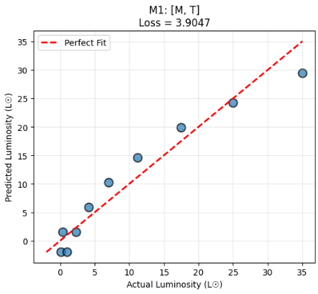
- M2 (cuadrático): Mejora significativa
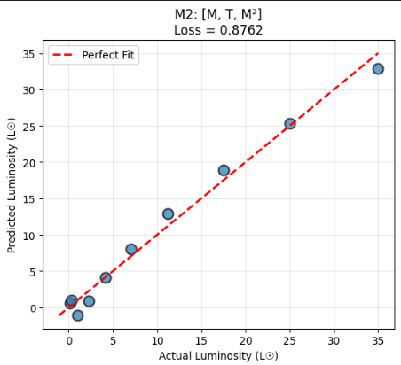
- M3 (completo): Mejor desempeño, menor pérdida
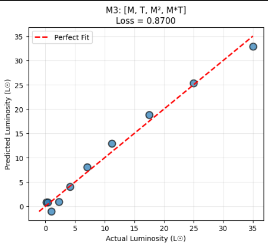

3. Interpretaciones Físicas:
El término de interacción M*T tiene significado físico: estrellas más calientes de la misma masa son más luminosas. El término cuadrático de masa captura la conocida relación L ∝ M^(3-4) para estrellas de secuencia principal. La regresión polinomial modela exitosamente la física estelar compleja.
4. Convergencia:
El descenso por gradiente convergió confiablemente para todos los modelos con α = 0.1. La normalización de características fue esencial para la convergencia estable. Aproximadamente 500-1000 iteraciones fueron suficientes para la convergencia.
Recomendaciones:
Para predicciones de luminosidad estelar en producción, utilizar el modelo completo M3 con todos los términos de interacción
Considerar características adicionales como el radio estelar o la clase espectral para mejorar la precisión
La regresión polinomial captura efectivamente relaciones astrofísicas no lineales.